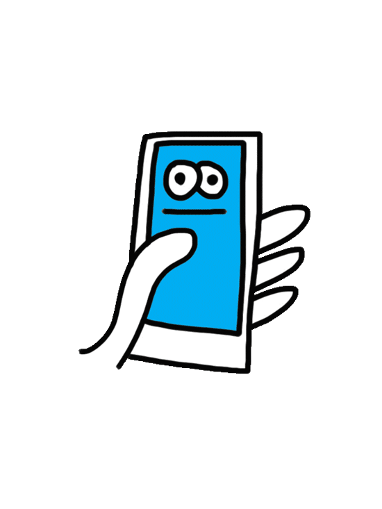
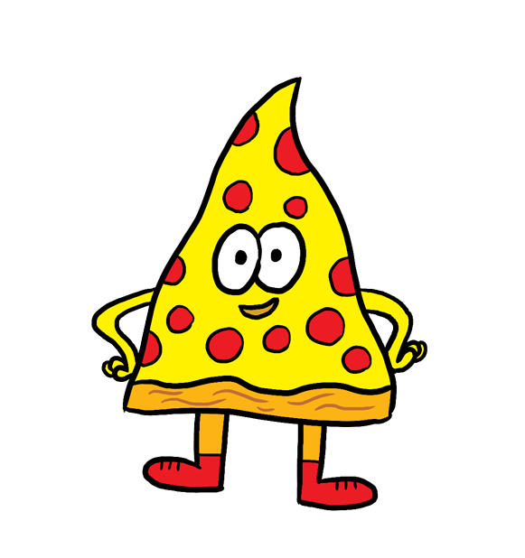

<h1 align="middle" > Scribble Learn </h1>

## Description:beginner:
Scribble Learn is a drawing and guessing game aiming to assist EFL learners studying English vocabularies. 

 

## Problem Statement:bangbang:
Vocabulary plays a vital role in learning English (Huang, Yang, Chiang, & Su, 2015). However, researches showed that English as Foreign Language (EFL) students tend to have difficulties with vocabulary learning (Ghazal, 2007; Yang & Dai, 2011). Scribble Learn is a drawing and guessing game. This game aims to serve as an assisting tool to increase class engagement and motivate learners in vocabulary learning by engaging them in an enjoyable and satisfying game involving deep processing.

 

## [video demo](https://youtu.be/s9RY32CvFbw):play_or_pause_button:

    

 

## How to play:question:
1. Teachers set up a game with a list of words aligned with the English course curriculum. 
2. Students join a game that their teacher set up with a secret passcode. 
3. When everybody is ready, the game starts.
4. One game consists of a few rounds in which every round a student has to draw the teacher assigned word, and others have to guess it to get points. 
    - If you are a drawer: You have 30-second to draw at each round. 
    - If you are a guesser: You have 30-second to guess from the context, what the target vocabulary is.
5. The round is over! The correct answer would be displayed on the screen, followed by a list of points students earned from the current round. 
6. Players take turns to draw and guess. 
7. The game is Over!
8. A ranking of each student's points being displayed. 
9. You would receive an individual summary of the word that they didn't guess right. Or a word you drew, but nobody guessed right!  
   Try to memorize the word better or improve your drawing! :sweat_smile:
   

    

 

## Technology:hammer:
* Programmed drawing games with HTML Canvas that allow users to draw with the cursor on the webpage.
* Incorporated Node.js and Socket.io to allow multiple players take turns drawing and chatting through the server.
* Built and designed the database schema with Rails and ActiveRecord to store user information and gameresults. 
* DesigneduserinterfacewithReact.js,BootstrapandCustomCSS.

 

## Credits
* The gifs in the game are made by artist [Jon Burgerman](https://www.jonburgerman.com/info).  
 He has more fantastic gif and artworks on his website.
